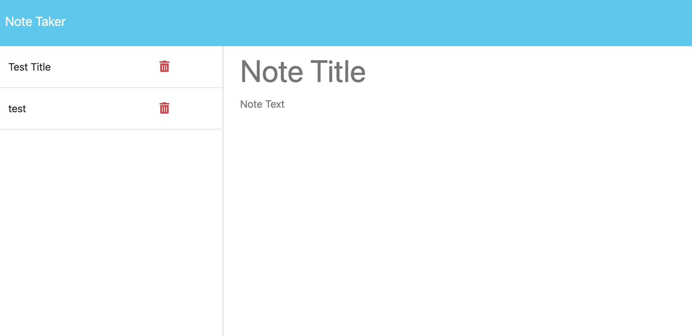

# 11 EXP JS NT

## Description 
AS A small business owner
I WANT to be able to write and save notes
SO THAT I can organize my thoughts and keep track of tasks I need to complete

## Deployed Application 
[Heroku Deployment](https://note-taker-11111-85c6ef1c84a0.herokuapp.com/)

[Github Repo link](https://github.com/TaajL/11-EXPJS-)

 

## Installation 
Node.js is needed to be able to run this code in the terminal.

## Usage 
GIVEN a note-taking application
WHEN I open the Note Taker
THEN I am presented with a landing page with a link to a notes page
WHEN I click on the link to the notes page
THEN I am presented with a page with existing notes listed in the left-hand column, plus empty fields to enter a new note title and the note’s text in the right-hand column
WHEN I enter a new note title and the note’s text
THEN a "Save Note" button and a "Clear Form" button appear in the navigation at the top of the page
WHEN I click on the Save button
THEN the new note I have entered is saved and appears in the left-hand column with the other existing notes and the buttons in the navigation disappear
WHEN I click on an existing note in the list in the left-hand column
THEN that note appears in the right-hand column and a "New Note" button appears in the navigation
WHEN I click on the "New Note" button in the navigation at the top of the page
THEN I am presented with empty fields to enter a new note title and the note’s text in the right-hand column and the button disappears

## Contributing
Contributions are welcome! Please submit a pull request.

## License
This project is licensed under the [MIT License](https://opensource.org/licenses/MIT).

## Authors
* [Taaj Logan](https://github.com/TaajL) 

## Credits 
Starter code provided by the MSU Coding Bootcamp. 

